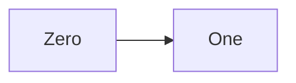
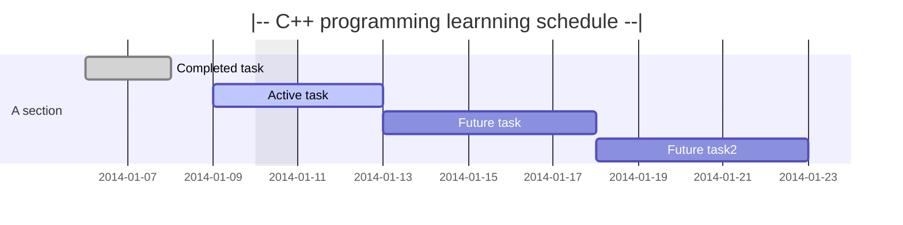
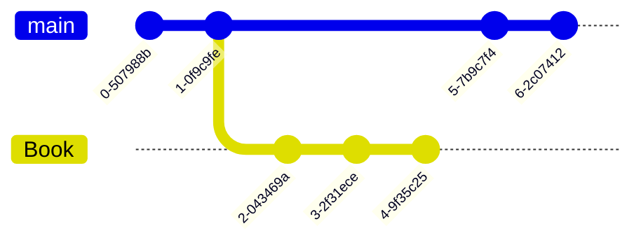

# CPP 
C++ programming learning `if` `else`

[https://blog.csdn.net/qq_32752467/article/details/127285592](https://blog.csdn.net/qq_32752467/article/details/127285592)


<https://mermaid-js.github.io/mermaid/#/>
```CPP
#include <iostream>
int main(){  
  using namespace std;
  cout<<“hello world!"<<endl;
  return 0;
}
```
 

<!--
Comments
-->



