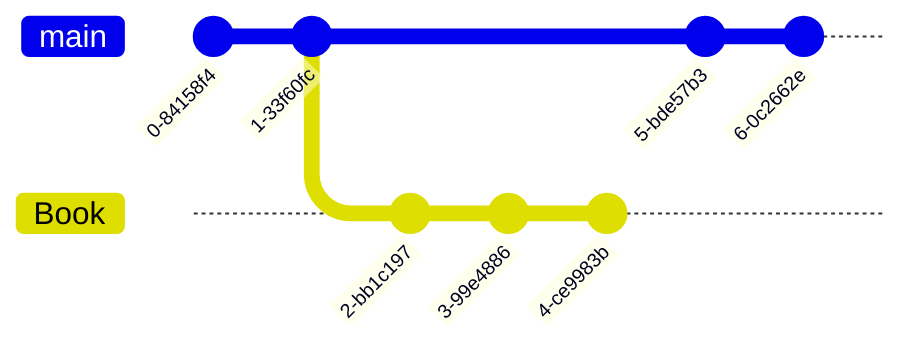

# CPP <https://mermaid-js.github.io/mermaid/#/>
C++ programming learning
```CPP
#include <iostream>
int main(){  
  using namespace std;
  cout<<“hello world!"<<endl;
  return 0;
}
```
 

<!--
Comments
-->



